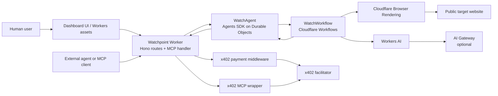

# Watchpoint


`Watchpoint` is a Cloudflare-native AI web monitoring agent for developers and other agents.

Most website monitoring tools tell you whether a page is up.
Watchpoint tells you whether the user experience is still working.

It visits a site like a lightweight agent, establishes a baseline, remembers what it saw, and checks the same flow again later. If something breaks, disappears, or changes in a meaningful way, it returns a report that explains what changed and why it matters.

This makes it useful for two kinds of users:
- a human developer who wants to catch visible breakage before users do
- another agent that wants to buy website monitoring as a ready-made capability instead of rebuilding browser automation, memory, and diffing from scratch

Typical flow:
1. Create a watch for a public URL.
2. Watchpoint runs a baseline browser session and stores the result.
3. Later it runs the same flow again.
4. If something changed, it tells you what changed, what looks broken, and what needs attention.

## Why it matters

What problem it solves:
- a site can be technically online and still be broken for users
- important flows can disappear between deploys without triggering classic monitoring
- raw browser automation output is noisy and expensive to turn into something useful
- other agents often need this capability, but should not have to build it from zero every time

## Architecture 🏗️

Current Cloudflare building blocks:
- `Agents SDK`
  - one `WatchAgent` per watch, persisted on Durable Objects
- `Workflows`
  - baseline run execution, waiting between rescans, retries, lifecycle progression
- `Browser Rendering`
  - runtime page inspection with deterministic step capture
- `Workers AI`
  - developer-facing run summaries
- `x402`
  - paid HTTP route and paid MCP tool surface
- `Workers Assets`
  - SPA assets served through the Worker `ASSETS` binding

### Infrastructure diagram



### Agentic component architecture

```mermaid
flowchart TD
    Create[Create watch\nUI / HTTP / MCP] --> AgentCreate[WatchAgent.createWatch]
    AgentCreate --> StateInit[Persist watch config\nruns=[] remainingRuns=N]
    AgentCreate --> WorkflowStart[runWorkflow WATCH_WORKFLOW]

    WorkflowStart --> Progress[reportProgress running]
    Progress --> AgentProgress[WatchAgent.onWorkflowProgress]

    WorkflowStart --> Capture[captureSession]
    Capture --> Step1[Step 1: landing page]
    Step1 --> FollowUp{same-origin\nfollow-up link?}
    FollowUp -->|yes| Step2[Step 2: follow-up page]
    FollowUp -->|no| Analysis[analyzeCapturedSession]
    Step2 --> Analysis

    Analysis --> Findings[derive findings + diff]
    Analysis --> Summary[Workers AI summary]
    Findings --> Complete[reportComplete run result]
    Summary --> Complete

    Complete --> AgentComplete[WatchAgent.onWorkflowComplete]
    AgentComplete --> Waiting[waiting state\nnextScheduledAt set]

    Manual[Manual rescan request] --> ManualGate{waiting and\nremainingRuns > 0?}
    ManualGate -->|yes| QueueManual[sendWorkflowEvent manual-rescan]
    QueueManual --> WorkflowStart
    ManualGate -->|no| Reject[409 already-running or exhausted]
```

Current runtime behavior:
1. A watch is created from the demo UI, the paid HTTP API, or a paid MCP tool.
2. A workflow runs the baseline scan.
3. The watch enters a `waiting` state until the next scheduled automatic rescan or a manual rescan request.
4. Each run stores captured browser steps, findings, and a diff against the previous run.
5. The watch eventually exhausts its included run budget.

Important scope note:
- the frontend is intentionally a compact reviewer surface and visual presentation layer
- it is useful for understanding the product flow quickly, but it does not represent the full operational complexity of the underlying infrastructure
- the real system design lives in the Agent, Workflow, capture, AI, payment, and persistent-state paths described above and implemented in the Worker codebase

## Product Surfaces ⚡

### Free demo dashboard 👀

Available at `/demo`.
The root path `/` normalizes to `/demo` in the SPA router.

Deployment status:
- live deployed dashboard: `https://cf-ai-watchpoint.zeroaddress.workers.dev/demo`
- local dashboard for development: `http://localhost:8787/demo`

Purpose:
- show the watch lifecycle quickly for a reviewer
- create a demo watch against deterministic fixture targets
- inspect run timeline, workflow state, and diff output

Recommended demo target:
- `https://watchpoint.local/regression`

Important:
- `watchpoint.local` is not a deployed public service
- it is a deterministic local fixture target used for demo and test flows

That fixture is intentionally healthy on the first run and broken on the next, so the regression flow is visible immediately.

### Paid HTTP API 💸

Current routes:
- `GET /api/health`
- `GET /api/pricing`
- `POST /api/demo/watch`
- `POST /api/watch/tiers/:tierId`
- `GET /api/watch/:watchId`
- `POST /api/watch/:watchId/rescan`

Important semantics:
- `POST /api/watch/tiers/:tierId`
  - returns official `402` behavior when unpaid
  - creates a watch when payment succeeds
- `POST /api/watch/:watchId/rescan`
  - returns `202` when a manual rescan is accepted
  - returns `409` when the watch is already queued/running or when the pack is exhausted

### Paid MCP surface 🤖

Mounted at `/mcp`.

Current tools:
- free:
  - `list_pricing`
  - `get_watch_status`
- paid:
  - `create_watch_standard`
  - `create_watch_premium`

## Model Tiers

Workers AI is the only inference backend in v1.

Pricing tiers currently exposed by the app:
- `standard`
  - display name: `GLM 4.7 Flash`
  - model id: `@cf/zai-org/glm-4.7-flash`
  - price: `$0.07`
  - included runs: `3`
- `premium`
  - display name: `Llama 3.3 70B`
  - model id: `@cf/meta/llama-3.3-70b-instruct-fp8-fast`
  - price: `$0.18`
  - included runs: `5`

Primary Cloudflare reference:
- <https://developers.cloudflare.com/workers-ai/models/glm-4.7-flash/>

If `WATCHPOINT_AI_GATEWAY_ID` is set, Workers AI requests are tagged and routed with AI Gateway metadata enabled.

## Reviewer Path

Fastest path to understand the project:
1. Open the dashboard.
   Current deployed URL: `https://cf-ai-watchpoint.zeroaddress.workers.dev/demo`
   Local dev URL: `http://localhost:8787/demo`
2. Create a demo watch for `https://watchpoint.local/regression`.
3. Wait for the baseline to complete.
4. Trigger a manual rescan.
5. Inspect the diff in the timeline and the workflow summary panel.

Fastest API proof:
1. `GET /api/pricing`
2. `POST /api/watch/tiers/standard` without payment to observe `402`
3. Retry with the dev bypass header locally, or real payment in a deployed environment

## Local Development

### Prerequisites

- Node.js `22` LTS recommended
- npm
- Wrangler authenticated for deploys and real remote resources

### Install

```bash
npm install
npm run cf-typegen
```

### Safe default checks

These are the low-risk commands to use during normal development:

```bash
npm run check
npm test
npm run build:ui
```

### Local run

```bash
npm run dev
```

This command builds the React dashboard first and then starts Wrangler.

Useful local URLs:
- dashboard: `http://localhost:8787/demo`
- health: `http://localhost:8787/api/health`
- pricing: `http://localhost:8787/api/pricing`
- MCP: `http://localhost:8787/mcp`

## Trying The Components

### Demo watch from the UI

Use the default fixture target:

```text
https://watchpoint.local/regression
```

This URL is fixture-only and exists to make the local demo deterministic.

Expected path:
- baseline succeeds
- watch enters `waiting`
- manual rescan succeeds
- second run shows a regression diff

### Paid HTTP flow in local development

Observe `402`:

```bash
curl -X POST http://localhost:8787/api/watch/tiers/premium \
  -H 'content-type: application/json' \
  -H 'accept: application/json' \
  -d '{"targetUrl":"https://watchpoint.local/stable","tierId":"premium"}'
```

Here too, `watchpoint.local` is just a local deterministic fixture target for development.

Create a paid watch locally using the explicit dev bypass:

```bash
curl -X POST http://localhost:8787/api/watch/tiers/standard \
  -H 'content-type: application/json' \
  -H 'x-watchpoint-dev-payment: watchpoint-local-paid' \
  -d '{"targetUrl":"https://watchpoint.local/stable","tierId":"standard"}'
```

### Remote MCP smoke validation

After deploy, the repository includes a remote smoke validator:

```bash
npm run test:mcp:remote
```

Required environment variables:
- `WATCHPOINT_MCP_URL`
- `WATCHPOINT_X402_PRIVATE_KEY`
- optional `WATCHPOINT_REMOTE_TARGET_URL`
- optional `WATCHPOINT_X402_NETWORK`

This smoke validator checks:
- tool discovery
- unpaid paid-tool behavior
- paid MCP create-watch flow
- follow-up watch status lookup

## Deployment Checklist

Before a real deploy:
- set a real `WATCHPOINT_X402_PAY_TO`
- confirm `WATCHPOINT_FACILITATOR_URL`
- optionally set `WATCHPOINT_AI_GATEWAY_ID`
- keep `WATCHPOINT_CAPTURE_MODE=browser` for runtime environments
- have a funded wallet/private key ready if you want to run the remote MCP smoke script

Suggested post-deploy smoke order:
1. check `/api/health`
2. check `/api/pricing`
3. exercise one paid HTTP or MCP create-watch path
4. fetch resulting watch status

## Testing Strategy

Watchpoint was implemented test-first with Cloudflare’s Agent testing guidance as the main reference.

Current validation layers:
- Worker/Agent integration tests with `vitest` and `@cloudflare/vitest-pool-workers`
- capture contract tests for deterministic browser fixture behavior
- local Playwright dashboard E2E, manual opt-in
- remote MCP smoke validation, manual opt-in

The most important deterministic coverage currently verifies:
- pricing and model metadata
- official `402` challenge behavior
- paid watch creation
- workflow-driven baseline and rescan behavior
- watch waiting/exhaustion semantics
- browser capture fallback and warning behavior
- regression detection between runs

## Cloudflare References

Primary source-of-truth references used for this project:
- <https://agents.cloudflare.com/>
- <https://developers.cloudflare.com/agents/>
- <https://developers.cloudflare.com/ai-gateway/>
- <https://developers.cloudflare.com/agents/getting-started/testing-your-agent/>
- <https://developers.cloudflare.com/agents/api-reference/run-workflows/>
- <https://developers.cloudflare.com/agents/guides/test-a-remote-mcp-server/>
- <https://developers.cloudflare.com/agents/x402/>
- <https://developers.cloudflare.com/workers-ai/models/glm-4.7-flash/>
